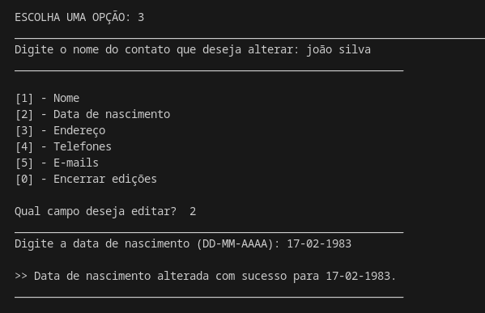

# Projeto: Agenda em Python

Este projeto é uma aplicação simples de agenda em Python que permite adicionar, consultar, editar e excluir contatos.

## Linguagens e Tecnologias Utilizadas

- Python
- Expressões regulares (re) para validação de dados
- Visual Studio Code

## Como executar o código ?

1 . Clone este repositório:

```
git clone https://github.com/seu-usuario/Projeto-Agenda.git
```

2 . Acesse o diretório do projeto:

```
cd Projeto-Agenda
```

3 . Execute o programa:

```
python3 agenda.py
```

4 . Após a execução, o sistema abrirá o seguinte menu interativo:


## Funcionalidades

### 1 . Adicionar novos contatos 
-> Adiciona um novo contato na agenda com nome, data de nascimento, endereço, telefones e e-mails.


### 2 . Consultar contatos cadastrados
-> Permite consultar os contatos salvos na agenda.


### 3 . Editar informações de contatos existentes
-> Permite editar informações de contatos já cadastrados, como nome, telefone e e-mail.



### 4 . Excluir contatos da agenda
-> Exclui contatos da agenda, removendo-os permanentemente.


##  Contribuição
Sinta-se à vontade para contribuir com melhorias para este projeto.